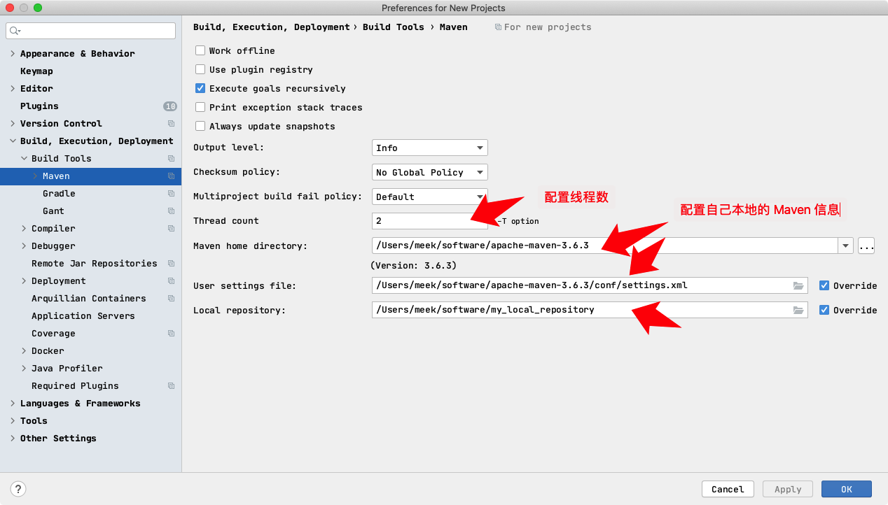
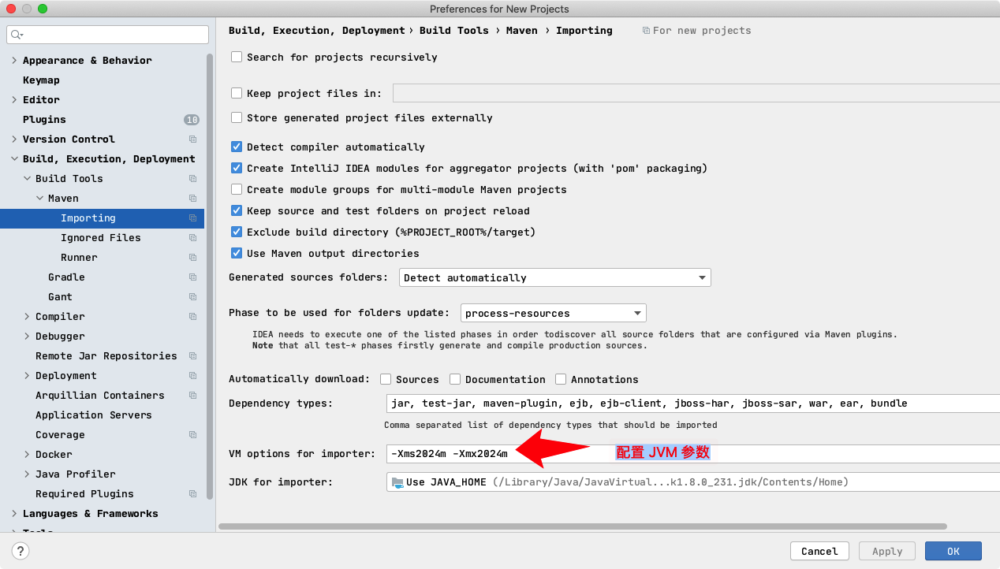
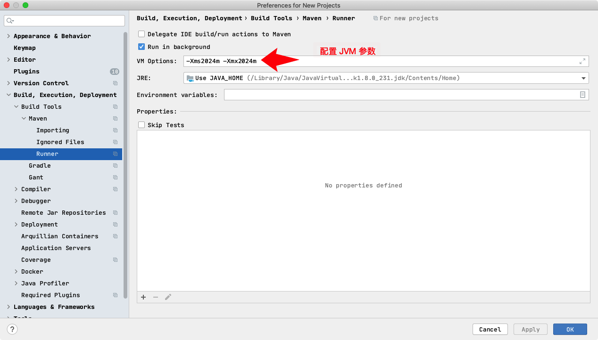
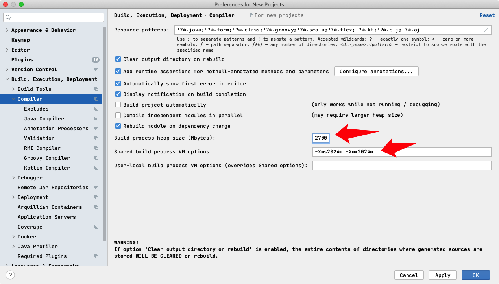
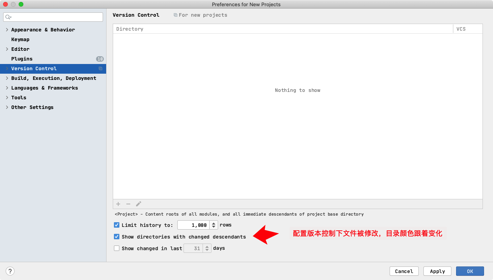

# IntelliJ IDEA 推荐设置讲解

## 说明

IntelliJ IDEA 有很多人性化的设置我们必须单独拿出来讲解，也因为这些人性化的设置让我们这些 IntelliJ IDEA 死忠粉更加死心塌地使用它和分享它。

## 推荐设置

- IntelliJ IDEA 的代码提示和补充功能有一个特性：区分大小写。如上图标注 1 所示，默认就是 `First letter` 区分大小写的。
- 区分大小写的情况是这样的：比如我们在 Java 代码文件中输入 `stringBuffer` IntelliJ IDEA 是不会帮我们提示或是代码补充的，但是如果我们输入 `StringBuffer` 就可以进行代码提示和补充。
- 如果想不区分大小写的话，改为 `None` 选项即可。

----------------------------------------------------------------------------

- 如上图标注 1 和 2 所示，默认 IntelliJ IDEA 是没有开启自动 import 包的功能。
	- 勾选标注 1 选项，IntelliJ IDEA 将在我们书写代码的时候自动帮我们优化导入的包，比如自动去掉一些没有用到的包。
	- 勾选标注 2 选项，IntelliJ IDEA 将在我们书写代码的时候自动帮我们导入需要用到的包。但是对于那些同名的包，还是需要手动 `Alt + Enter` 进行导入的，IntelliJ IDEA 目前还无法智能到替我们做判断。

----------------------------------------------------------------------------

- 如上图标注红圈所示，我们可以对指定代码类型进行默认折叠或是展开的设置，勾选上的表示该类型的代码在文件被打开的时候默认是被折叠的，去掉勾选则反之。

----------------------------------------------------------------------------

- 如上图 Gif 所示，IntelliJ IDEA 支持对代码进行垂直或是水平分组。一般在对大文件进行修改的时候，有些修改内容在文件上面，有些内容在文件下面，如果来回操作可能效率会很低，用此方法就可以好很多。当然了，前提是自己的显示器分辨率要足够高。
- 如果经常使用分屏，也可以考虑设置快捷键，快捷设置可以查看 [此文章](https://github.com/judasn/IntelliJ-IDEA-Tutorial/blob/master/keymap-introduce.md)
	- 垂直分屏快捷键关键字：`Split Vertically`
	- 水平分屏快捷键关键字：`Split Horizontally`

----------------------------------------------------------------------------

- 如上图 Gif 所示，在没有对 `Ctrl + D` 快捷键进行修改前，此快捷键将是用来复制并黏贴所选的内容的，但是黏贴的位置是补充在原来的位置后，我个人不喜欢这种风格，我喜欢复制所选的行数完整内容，所以进行了修改，修改后的效果如上图 Gif 演示。

----------------------------------------------------------------------------

- 如上图 Gif 所示，默认 `Ctrl + 空格` 快捷键是基础代码提示、补充快捷键，但是由于我们中文系统基本这个快捷键都被输入法占用了，所以我们发现不管怎么按都是没有提示代码效果的，原因就是在此。我个人建议修改此快捷键为 `Ctrl + 逗号`。

----------------------------------------------------------------------------

- 如上图 Gif 所示，IntelliJ IDEA 14 以后版本默认是不显示内存使用情况的，对于大内存的机器来讲不显示也无所谓，但是如果是内存小的机器最好还是显示下。如上图演示，点击后可以进行部分内存的回收。

----------------------------------------------------------------------------

- 如上图 Gif 所示，我们可以勾选此设置后，增加 `Ctrl + 鼠标滚轮` 快捷键来控制代码字体大小显示。

----------------------------------------------------------------------------

- 如上图红圈所示，默认 IntelliJ IDEA 是没有勾选 `Show line numbers` 显示行数的，但是我建议一般这个要勾选上。
- 如上图红圈所示，默认 IntelliJ IDEA 是没有勾选 `Show method separators` 显示方法线的，这种线有助于我们区分开方法，所以也是建议勾选上的。

----------------------------------------------------------------------------

- 默认 IntelliJ IDEA 是有一套自己的 IDE 整体设置的，比如 IDE 设置中我们常修改的：默认编码、编译版本、Maven 本地库路径等等，这些其实是可以避免的。
- 按正常设置 Project 流程的话，我们在 Project 状态下进行 IDE 设置，这些设置并不会被当做一个标准的 IDE 设置模板保存起来，所以你下次打开一个新的 Project 还是要重新设置的，为了简便操作，你可以按上图 Gif 所示进行设置 `Default Settings，这样下次打开新的 Project 就会以这个 IDE 设置进行。
- 需要注意的是：设置好配置之后，你需要重启 IntelliJ IDEA，重启之后的 IntelliJ IDEA 重新打开 Project 才能有效果。

----------------------------------------------------------------------------

- 如上图标注 1 所示，在打开很多文件的时候，IntelliJ IDEA 默认是把所有打开的文件名 Tab 单行显示的。但是我个人现在的习惯是使用多行，多行效率比单行高，因为单行会隐藏超过界面部分 Tab，这样找文件不方便。

----------------------------------------------------------------------------

- 如上图 Gif 所示，默认 IntelliJ IDEA 对于 Java 代码的单行注释是把注释的斜杠放在行数的最开头，我个人觉得这样的单行注释非常丑，整个代码风格很难看，所以一般会设置为单行注释的两个斜杠跟随在代码的头部。

----------------------------------------------------------------------------

- 如上图 Gif 所示，对于横向太长的代码我们可以进行软分行查看。软分行引起的分行效果是 IntelliJ IDEA 设置的，本质代码是没有真的分行的。

----------------------------------------------------------------------------

- 如上图标注 1 所示，勾选此选项后，启动 IntelliJ IDEA 的时候，默认会打开上次使用的项目。如果你只有一个项目的话，该功能还是很好用的，但是如果你有多个项目的话，建议还是关闭，这样启动 IntelliJ IDEA 的时候可以选择最近打开的某个项目。
- 如上图红圈所示，该选项是设置当我们已经打开一个项目窗口的时候，再打开一个项目窗口的时候是选择怎样的打开方式。
	- `Open project in new window` 每次都使用新窗口打开。
	- `Open project in the same window` 每次都替换当前已打开的项目，这样桌面上就只有一个项目窗口。
	- `Confirm window to open project in` 每次都弹出提示窗口，让我们选择用新窗口打开或是替换当前项目窗口。

----------------------------------------------------------------------------

- 如上图箭头所示，该设置可以增加打开的文件 Tab 个数，当我们打开的文件超过该个数的时候，早打开的文件会被新打开的替换。

----------------------------------------------------------------------------

- 默认 IntelliJ IDEA 是没有开启自动帮你生成 serialVersionUID 的，需要我们自行设置。
- 如上图第一张，需要先勾选：`Serializable class without serialVersionUID`
- 如上图第二张，在已经继承了 Serializable 接口的类名上，把光标放在类名上（必须这样做），按 `Alt + Enter`，即可提示帮你生成 serialVersionUID 功能。

----------------------------------------------------------------------------

- 如上图所示设置默认浏览器。因为我个人有专属的测试浏览器，所以希望默认从控制台输出的链接是用测试浏览器打开，就可以这样设置。

----------------------------------------------------------------------------

----------------------------------------------------------------------------

----------------------------------------------------------------------------

----------------------------------------------------------------------------

----------------------------------------------------------------------------

----------------------------------------------------------------------------

